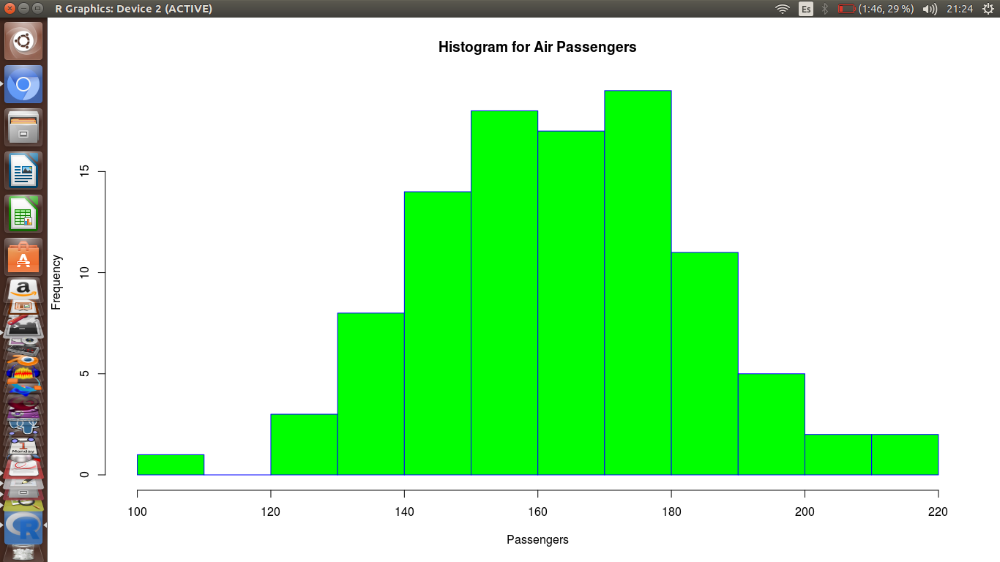
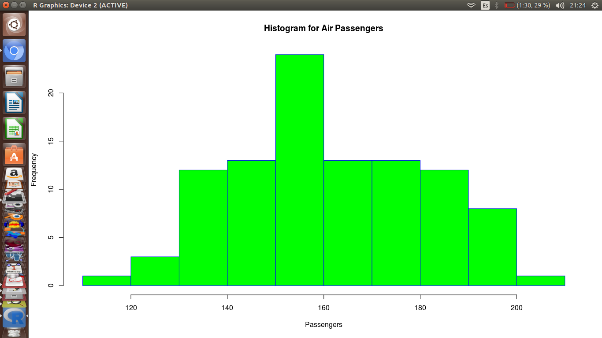
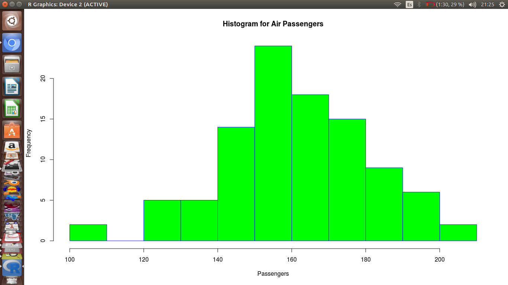
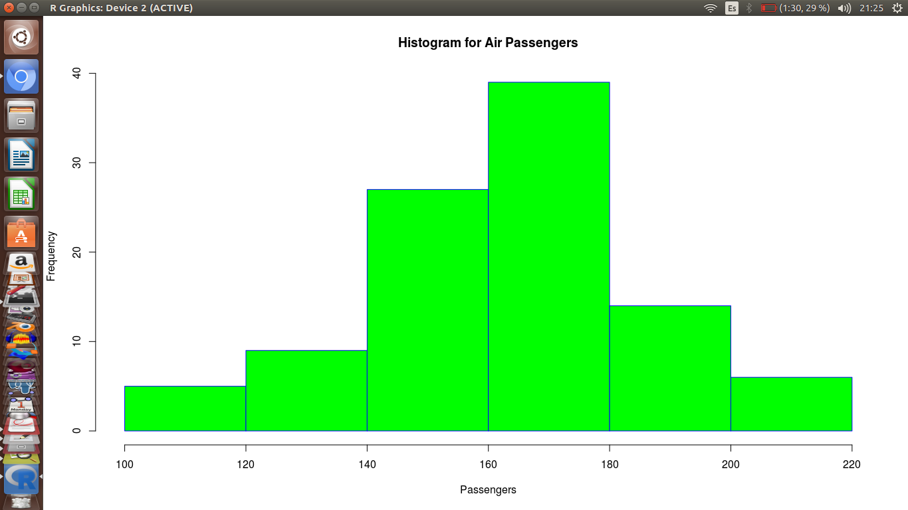
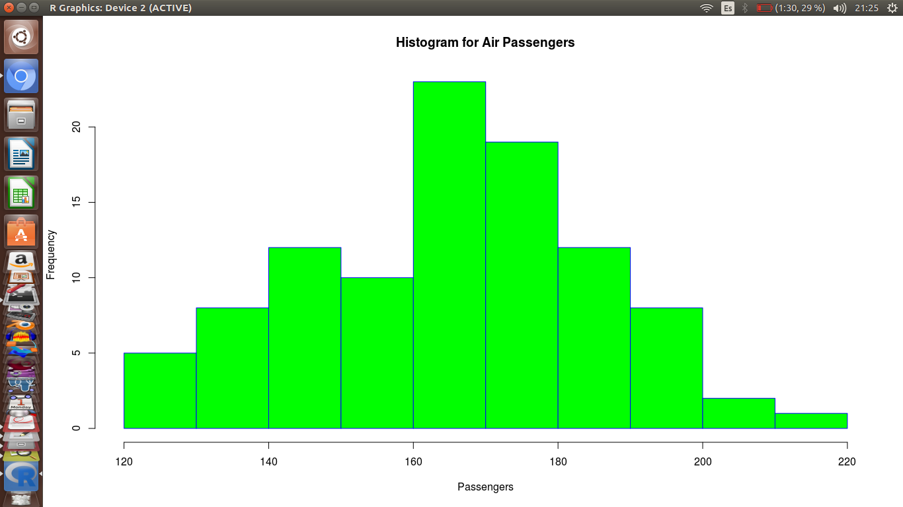
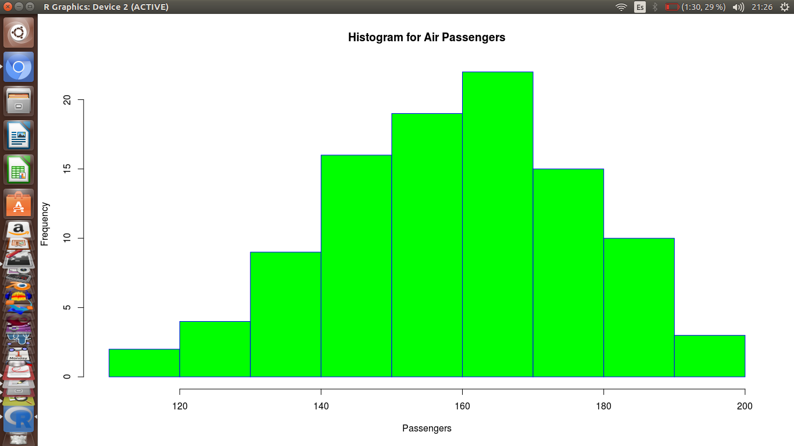
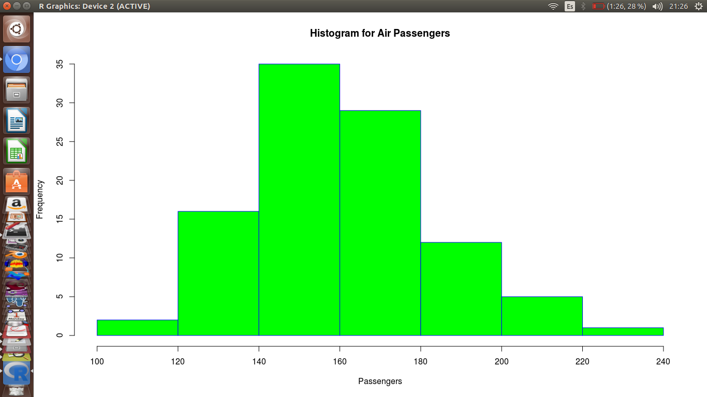
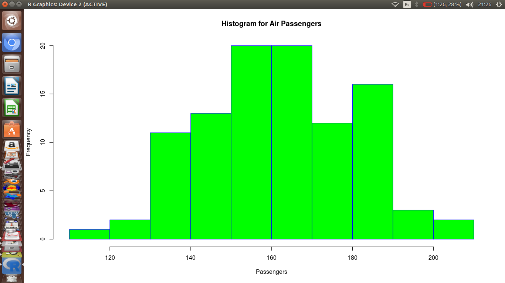
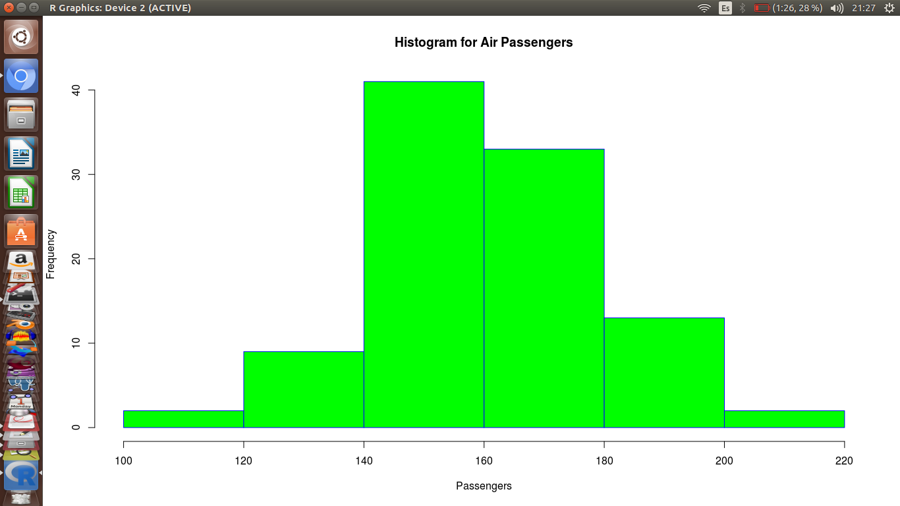

## Nombre: Franco Najarro Mallqui 20081384c
## Ejercicio 1  
##En este ejercicio generaremos lo que se llama regresion a la media para una poblacion de hombres y mujeres y sus generaciones.

Se esta usando el data.frame popular para recolectar las tallas aleatorias de 100 hombres  mujeres. Se usa la funcion 'rnorm(100, 160, 20)'.

'popular <- data.frame(m = rnorm(100, 160, 20), f = rnorm(100, 160, 20))'

La siguiente funcion usa la funcion 'sample' para generar una permutacion aleatoria del data.frame anterior.
Hay 100 filas y 2 columnas con tallas de hombres y mujeres.

~~~
prox.gen <- function(popular) {
popular$m <- sample(popular$m)
popular$m <- apply(popular, 1, mean)
popular$f <- popular$m
return(popular)
 }

~~~

Ahora se usara la funcion 'hist' para generar la grafica de la distribucion de las tallas.Los parametros son:

~~~
 
hist(popular$m, main="Histogram for Air Passengers", xlab="Passengers", border="blue", col="green")

~~~

La siguiente funcion coge todo lo anterior para generar las tallas de las siguientes generaciones y a continuacion plotea la distribucion de las tallas de la generacion proxima.

~~~
n.gen.grafica<- function() {
popular <- data.frame(m = rnorm(100, 160, 20), f = rnorm(100, 160, 20))
prox.gen(popular)
hist(popular$m, main="Histograma para la distribucion de las alturas masculinas", xlab="Passengers", border="blue", col="green")
}
~~~

Ahora generando las graficas de las proximas 9 generaciones usando la funcion anterior:

1) Primera generacion:

'n.gen.grafica()'

2) Segunda generacion:

'n.gen.grafica()'

3) Tercera generacion:

'n.gen.grafica()'

4) Cuarta generacion:

'n.gen.grafica()'

5) Quinta generacion:

'n.gen.grafica()'

6) Sexta generacion:

'n.gen.grafica()'

7) Septima generacion:

'n.gen.grafica()'

8) Octava generacion generacion:

'n.gen.grafica()'

9) Novena generacion:

'n.gen.grafica()'

